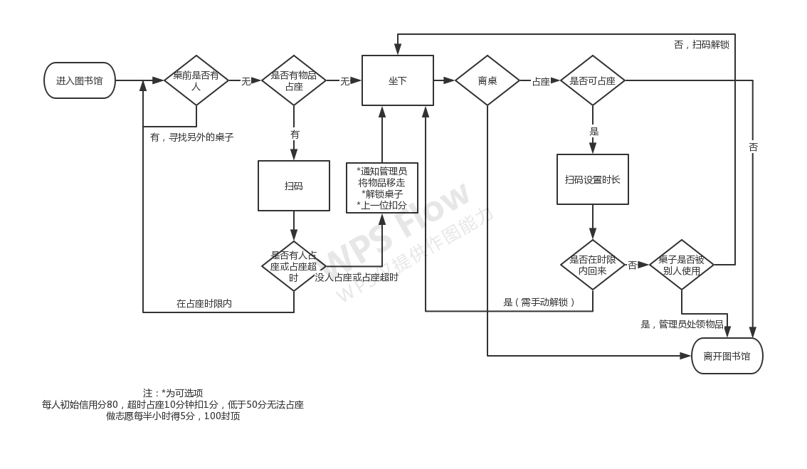

# 安装
- 下载微信开发工具
- 新建云开发模板
- 将cloudfunctions.zip 解压，与全部文件一起导入

## 云开发 quickstart

这是云开发的快速启动指引，其中演示了如何上手使用云开发的三大基础能力：

- 数据库：一个既可在小程序前端操作，也能在云函数中读写的 JSON 文档型数据库
- 文件存储：在小程序前端直接上传/下载云端文件，在云开发控制台可视化管理
- 云函数：在云端运行的代码，微信私有协议天然鉴权，开发者只需编写业务逻辑代码

## 参考文档

- [云开发文档](https://developers.weixin.qq.com/miniprogram/dev/wxcloud/basis/getting-started.html)

